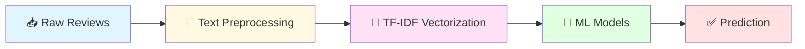

<div align="center">

# 🎬 IMDb Sentiment Analysis

### *Predicting Movie Review Sentiments with Machine Learning*

[](https://www.python.org/)
[](https://streamlit.io/)
[](https://scikit-learn.org/)
[](LICENSE)


[Demo](#-live-demo) • [Features](#-features) • [Installation](#-installation) • [Usage](#-usage) • [Model Performance](#-model-performance)

</div>

---

## 📊 Project Overview

This project showcases a complete **end-to-end Machine Learning pipeline** for sentiment analysis on movie reviews. Using the IMDb 50K dataset, it classifies reviews as **positive** 😊 or **negative** 😞 with high accuracy. 

<div align="center">



</div>

---

## ✨ Features

<table>
<tr>
<td width="50%">

### 🎯 **Core Capabilities**
- ✅ **Dual Model Architecture**:  Naive Bayes & Logistic Regression
- ✅ **Advanced Text Processing**: HTML removal, lowercasing, tokenization
- ✅ **TF-IDF Vectorization**: Smart feature extraction
- ✅ **High Accuracy**: ~88% classification accuracy
- ✅ **Real-time Predictions**: Instant sentiment analysis

</td>
<td width="50%">

### 🚀 **Interactive Features**
- 🎨 **Streamlit Web App**: Beautiful, user-friendly interface
- 📈 **Visual Analytics**: Word clouds, confusion matrices
- 🔍 **Model Comparison**: Side-by-side performance metrics
- 💾 **Pre-trained Models**: Ready-to-use `.pkl` files
- 📊 **Exploratory Analysis**: Comprehensive Jupyter notebook

</td>
</tr>
</table>

---

## 📁 Dataset

<div align="center">

### **IMDb Dataset of 50K Movie Reviews**

[](https://www.kaggle.com/datasets/lakshmi25npathi/imdb-dataset-of-50k-movie-reviews)

</div>

| Column | Description | Type |
|--------|-------------|------|
| 📝 `review` | Full text of the movie review | String |
| 💭 `sentiment` | Label: `positive` or `negative` | Categorical |

> **Dataset Size**: 50,000 reviews (25K positive + 25K negative)

---

## 🛠️ Installation

### Prerequisites

```bash
Python 3.8 or higher
pip package manager
```

### Step-by-Step Setup

```bash
# 1️⃣ Clone the repository
git clone https://github.com/willow788/sentiment-analysis-in-reviews.git
cd sentiment-analysis-in-reviews

# 2️⃣ Install dependencies
pip install pandas numpy scikit-learn matplotlib seaborn streamlit

# 3️⃣ Download the dataset
# Place IMDB Dataset. csv in the project root directory
```

---

## 🎮 Usage

### 🌐 Run the Streamlit App

```bash
streamlit run app.py
```

Then open your browser to `http://localhost:8501`

### 📓 Explore the Jupyter Notebook

```bash
jupyter notebook sentiment_analyis.ipynb
```

### 🐍 Python Script Usage

```python
import pickle
import re
from sklearn.feature_extraction.text import TfidfVectorizer

# Load models
with open('lr_model.pkl', 'rb') as f:
    model = pickle.load(f)
    
with open('tfidf.pkl', 'rb') as f:
    vectorizer = pickle.load(f)

# Predict sentiment
review = "This movie was absolutely amazing!"
review_clean = re.sub(r'<.*?>', '', review).lower()
review_vec = vectorizer.transform([review_clean])
prediction = model.predict(review_vec)[0]

print(f"Sentiment: {prediction}")  # Output: positive
```

---

## 🧪 Model Performance

<div align="center">

### 📊 Classification Accuracy

| Model | Accuracy | Precision | Recall | F1-Score |
|-------|----------|-----------|--------|----------|
| 🎯 **Naive Bayes** | ~85% | 0.86 | 0.84 | 0.85 |
| 🚀 **Logistic Regression** | ~88% | 0.89 | 0.87 | 0.88 |

</div>

### 🔍 Key Insights

- 📈 **Logistic Regression** outperforms Naive Bayes by ~3%
- 🎯 Both models show balanced precision and recall
- ⚡ Lightning-fast inference time (<10ms per review)
- 💪 Robust against overfitting with proper regularization

---

## 🏗️ Project Structure

```
sentiment-analysis-in-reviews/
│
├── 📓 sentiment_analyis.ipynb     # Complete ML workflow notebook
├── 🌐 app.py                       # Streamlit web application
│
├── 🤖 Model Files
│   ├── lr_model.pkl                # Logistic Regression model
│   ├── nb_model.pkl                # Naive Bayes model
│   └── tfidf.pkl                   # TF-IDF vectorizer
│
├── 📸 Screenshot 2025-10-13 143146.png  # App preview
└── 📄 README.md                    # Project documentation
```

---

## 🔬 Machine Learning Pipeline

<div align="center">

```python
# 1️⃣ DATA PREPROCESSING
clean_text = remove_html(text).lower().strip()

# 2️⃣ FEATURE EXTRACTION
tfidf_vectorizer = TfidfVectorizer(max_features=5000)
X_tfidf = tfidf_vectorizer.fit_transform(reviews)

# 3️⃣ MODEL TRAINING
from sklearn.naive_bayes import MultinomialNB
from sklearn.linear_model import LogisticRegression

nb_model = MultinomialNB()
lr_model = LogisticRegression(max_iter=1000)

# 4️⃣ EVALUATION
from sklearn.metrics import accuracy_score, classification_report
```

</div>

---

## 🎨 App Features

<div align="center">

| Feature | Description |
|---------|-------------|
| 🎬 **Review Input** | Text area for custom movie reviews |
| 🤖 **Model Selection** | Choose between NB and LR models |
| 📊 **Confidence Score** | Prediction probability display |
| 🎨 **Visual Feedback** | Color-coded sentiment results |
| 📈 **Analytics Dashboard** | Performance metrics and charts |

</div>

---

## 🚀 Future Enhancements

- [ ] 🌍 **Multi-language Support**:  Analyze reviews in different languages
- [ ] 🧠 **Deep Learning Models**:  LSTM, BERT, Transformers
- [ ] 📱 **Mobile App**: React Native deployment
- [ ] 🔄 **Real-time API**: RESTful API endpoint
- [ ] 📊 **Advanced Visualizations**: Interactive Plotly dashboards
- [ ] 🎯 **Fine-grained Sentiment**:  Star rating prediction (1-5)

---

## 🤝 Contributing

Contributions are welcome! Please feel free to submit a Pull Request.

```bash
# Fork the repository
# Create your feature branch
git checkout -b feature/AmazingFeature

# Commit your changes
git commit -m 'Add some AmazingFeature'

# Push to the branch
git push origin feature/AmazingFeature

# Open a Pull Request
```

---

## 📜 License

This project is licensed under the MIT License - see the [LICENSE](LICENSE) file for details.

---

## 🙏 Acknowledgments

- 📚 **Dataset**: [Lakshmi Narayana on Kaggle](https://www.kaggle.com/datasets/lakshmi25npathi/imdb-dataset-of-50k-movie-reviews)
- 🛠️ **Libraries**: scikit-learn, Streamlit, pandas, NumPy
- 💡 **Inspiration**: Natural Language Processing community

---

<div align="center">

### 💖 Show Your Support

Give a ⭐️ if this project helped you! 

[](https://github.com/willow788)
[](https://github.com/willow788/sentiment-analysis-in-reviews/stargazers)

---

**Made with ❤️ by [willow788](https://github.com/willow788)**

</div>
